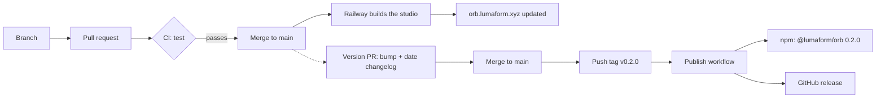

# How a change reaches users

This project ships to two places, by two different paths:

- **The studio website**, [orb.lumaform.xyz](https://orb.lumaform.xyz). It updates by itself every time something lands on `main`.
- **The npm package**, [`@lumaform/orb`](https://www.npmjs.com/package/@lumaform/orb). It updates only when you decide to release a version.

This page explains both, step by step, with the release of 0.2.0 as the worked example. For the short checklist, see [RELEASING.md](RELEASING.md).



The solid path runs on every change. The dotted path runs only when you choose to release.

## Part 1. Every change: branch, pull request, merge

You never change `main` directly. `main` is **protected** by a GitHub ruleset called "Protect main":

- **Every change arrives through a pull request (PR).** Even yours: GitHub refuses a direct `git push` to `main`.
- **The `test` check must pass before you can merge.** That's CI, described below.
- **`main` can't be force-pushed or deleted.** Its history can't be rewritten by accident.
- **Linear history.** PRs are merged with **Rebase and merge**, which replays their commits on top of `main` one by one instead of adding a merge commit.

Why bother when you're the only maintainer? Because releases are published from `main`. If everything on `main` passed CI, everything that reaches npm passed CI.

**CI** (continuous integration) is `.github/workflows/ci.yml`. On every PR and every push to `main`, a fresh GitHub machine runs:

| Command | What it proves |
|---|---|
| `npm ci` | The lockfile installs cleanly. |
| `npm test` | All the test suites pass. |
| `npm run build` | The studio builds. |
| `npm run verify:package` | The npm package, packed exactly as it would be published, installs in an empty project and every entry point imports. |

A typical change:

```bash
git checkout main && git pull            # start from the latest main
git checkout -b my-change                # a branch for the work
# ...edit, then run the tests yourself...
npm test
git add -A && git commit -m "Say what changed and why"
git push -u origin my-change
gh pr create --fill                      # open the pull request
```

Then wait for the `test` check. Until it passes the PR shows as **Blocked**; afterwards it's **Clean**. Merge it on the PR page with **Rebase and merge**, or run `gh pr merge --rebase --delete-branch`. The branch is deleted automatically after the merge.

**If the change affects users of the npm package** (an export, how an engine looks or behaves, a parameter, the config format), add a line under `## [Unreleased]` in `packages/orb/CHANGELOG.md` in the same PR. That's how the next release's notes write themselves.

## Part 2. The studio website updates itself

[Railway](https://railway.com) watches `main`. Each merge starts a new build: it installs, runs `npm run build`, and serves `packages/studio/dist`. It takes about four minutes, and the old version stays online until the new one is ready.

To check that it's live, open the site and hard-refresh. The Railway dashboard shows each deploy, with the commit it was built from.

## Part 3. The npm package changes only when you release

Merging to `main` **never** publishes anything to npm. `main` can be ahead of npm for as long as you like, and people installing `@lumaform/orb` keep getting the last released version.

That's deliberate, because **a version number can be used only once**. Once `0.2.0` is published it can be deprecated but never replaced, not even after deleting it. So a person decides when a version is ready.

### Picking the version number

Versions follow [semantic versioning](https://semver.org), `MAJOR.MINOR.PATCH`. While the major number is 0, the package is "pre-1.0" and the rule is:

| Change | Bump | Example |
|---|---|---|
| Fixes only; nothing a user relies on changes shape | patch: 0.2.0 → 0.2.1 | a bug fix in one engine |
| Anything else, including new features and breaking changes | minor: 0.2.0 → 0.3.0 | a new option or engine parameter, a renamed export |

**0.2.0 is a minor release** because it adds features: the `pixelRatio` option, three engine parameters, and a new way Superposition renders. The `[Unreleased]` section of the changelog already listed all of that, which made the decision easy.

## Part 4. Releasing, step by step: 0.2.0

### Step 1: the version PR

A small PR that changes three files:

- `packages/orb/package.json`: `"version": "0.2.0"`
- `package-lock.json`: the same number, written by `npm version 0.2.0 -w @lumaform/orb --no-git-tag-version`
- `packages/orb/CHANGELOG.md`:
  - `## [Unreleased]` becomes `## [0.2.0] - 2026-09-25`;
  - a fresh, empty `## [Unreleased]` goes above it;
  - the links at the bottom are updated.

For 0.2.0 this was [PR #8](https://github.com/abektes/lumaform-orb/pull/8). Merging it still publishes nothing.

### Step 2: tag the release

A **tag** is a permanent name for one commit, and `v0.2.0` names the commit that becomes version 0.2.0. Pushing that tag is what starts the release:

```bash
git checkout main && git pull            # the merged version PR must be here
git tag -a v0.2.0 -m "@lumaform/orb 0.2.0"
git push origin v0.2.0
```

Tag only after the version PR is merged, on an up-to-date `main`. The workflow refuses anything else (step 3).

### Step 3: watch the Publish workflow

Open the repository's **Actions** tab, then **Publish**. The run for `v0.2.0` goes through these steps:

| Step | What it does |
|---|---|
| npm is new enough | Trusted publishing needs npm 11.5.1 or later; upgrades it if needed. |
| The tag, the package version and the changelog agree | Stops **before anything is spent** if the tag isn't `v` + the package version, the commit isn't on `main`, the changelog has no dated section for the version, or the version is already on npm. |
| `npm ci`, `npm test`, `npm run verify:package` | The same checks as CI, once more, on exactly the tagged commit. |
| Publish to npm | `npm publish`. **The irreversible moment.** |
| GitHub release from the changelog | Creates the release page, using the version's changelog section as its notes. |

A green run means the version is on npm and the GitHub release exists.

### Step 4: check it like a user would

```bash
npm view @lumaform/orb version           # should print 0.2.0
```

The [npm page](https://www.npmjs.com/package/@lumaform/orb) should show 0.2.0 with its README and a **provenance** badge. The GitHub **Releases** page should list `@lumaform/orb 0.2.0`. For a full check, install it in an empty folder with `npm install @lumaform/orb three` and import it.

## Part 5. Why publishing needs no password or token

The workflow publishes with npm's **trusted publishing**:

1. On npmjs.com, the package's settings say: *trust GitHub Actions, repository `abektes/lumaform-orb`, workflow file `publish.yml`, permission **npm publish**, no environment*.
2. When the workflow runs, GitHub gives it a short-lived signed token (OIDC) that says "this is `publish.yml` in `abektes/lumaform-orb`".
3. npm checks that token against its settings and accepts the upload. No long-lived npm token exists anywhere, so there's nothing to leak.

npm also records **provenance**: a signed statement linking the published tarball to the exact commit and workflow run that built it. That's the badge on the npm page, and it lets anyone check that the package came from this repository.

Two consequences:

- **Don't rename `publish.yml`** without updating the npm setting. npm trusts that exact file name.
- **Manual publishing still works** as an emergency fallback: `npm publish -w @lumaform/orb` from your own machine. It asks for your 2FA code, since publishing access is set to "require two-factor authentication and disallow tokens".

## When something goes wrong

| What you see | What it means | What to do |
|---|---|---|
| PR shows **Blocked** | CI hasn't finished, or failed. | Open the PR's **Checks** tab. Fix the failure, push again, and the check reruns. |
| `git push` to `main` is rejected | `main` is protected. | Push a branch and open a PR. |
| Publish fails at "The tag, the package version and the changelog agree" | A guard caught a mistake (the log says which). **Nothing was published.** | Fix it in a PR, then move the tag (below). |
| Publish fails at "Publish to npm" with an auth error (403 or 404) | npm didn't accept the workflow's identity. | Check the trusted publisher settings: `abektes`, `lumaform-orb`, `publish.yml`, permission **npm publish**, Environment **empty**. Then rerun the job from the Actions page. |
| Publish fails only at the GitHub release step | The package **is** published; only the release page is missing. | Create it by hand (the command is in [RELEASING.md](RELEASING.md#if-the-workflow-fails)). |
| A published version has a bug | Versions can't be replaced. | Release a fixed patch version, then warn people off the bad one with `npm deprecate @lumaform/orb@0.2.0 "Broken X; use 0.2.1"`. |
| The studio didn't update after a merge | The Railway build failed or is still running. | Check the latest deploy's build log in Railway. |

**Moving a tag** (only when nothing was published):

```bash
git push origin :refs/tags/v0.2.0        # delete it on GitHub
git tag -d v0.2.0                        # delete it locally
# fix, merge, pull main, then tag and push again
```

## Words used above

| Word | Meaning |
|---|---|
| **Branch** | A separate line of work. `main` is the one everything ships from. |
| **Pull request (PR)** | A proposal to merge a branch into `main`, with its CI result and review. |
| **CI** | Automatic checks GitHub runs on each PR and push. Here, the `test` job. |
| **Ruleset** | GitHub's protection rules for a branch: "Protect main". |
| **Rebase and merge** | Adds a PR's commits to `main` one by one, keeping history in a straight line. |
| **Tag** | A permanent name for one commit. `v0.2.0` marks the released commit. |
| **Semantic versioning** | `MAJOR.MINOR.PATCH`, where the number that changes tells users what kind of change it is. |
| **Changelog** | `packages/orb/CHANGELOG.md`, the human-readable list of changes in each version. |
| **npm organisation** | `lumaform`, which owns the `@lumaform/` name. Its members can publish under it. |
| **Tarball** | The `.tgz` file npm uploads: exactly what users download. `npm publish --dry-run` shows its contents. |
| **Trusted publishing (OIDC)** | Publishing from CI with a short-lived identity token instead of a stored npm token. |
| **Provenance** | npm's signed record of which commit and workflow built a version. |
| **2FA** | Two-factor authentication, required on your npm account for anything done by hand. |

## Cheat sheet

```bash
# A change
git checkout main && git pull && git checkout -b my-change
npm test
git push -u origin my-change && gh pr create --fill
gh pr merge --rebase --delete-branch     # once the test check has passed

# A release (after the version PR is merged)
git checkout main && git pull
git tag -a vX.Y.Z -m "@lumaform/orb X.Y.Z"
git push origin vX.Y.Z                   # then watch Actions → Publish
npm view @lumaform/orb version
```
